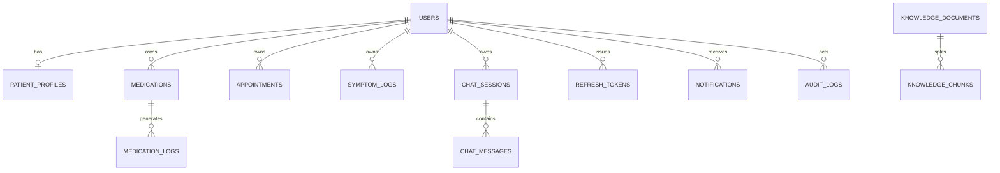

# Database design (Phase 5)

Persistence foundation for ThyroCare AI. No public CRUD or auth APIs in this phase.

## Collections

See `app/db/collections.py` for canonical names: users, patient_profiles, refresh_tokens, medications, medication_logs, appointments, symptom_logs, chat_sessions, chat_messages, knowledge_documents, knowledge_chunks, user_feedback, emergency_events, resources, notifications, audit_logs, schema_migrations.

## Conventions

- `_id` ObjectId internally; public `id` string
- UTC-aware `created_at` / `updated_at`
- Soft delete where meaningful (`is_deleted`, `deleted_at`, `deleted_by`)
- `schema_version` (starts at 1)
- Ownership via `user_id` on patient-owned collections

## Relationships (logical)

## Soft delete & lifecycle

- Default repository reads exclude soft-deleted rows
- Append-only logs (symptoms, medication logs, chat messages, audit) do not soft-delete
- TTL: refresh_tokens.expires_at, notifications.expires_at

## Schema versions

Documents carry `schema_version`. Applied migrations recorded in `schema_migrations`. Phase 5 initial migration creates indexes only (non-destructive).
