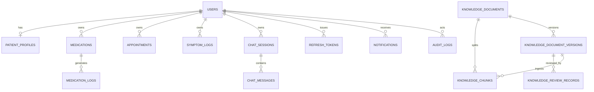

# Database design (Phase 5, extended Phase 12)

Persistence foundation for ThyroCare AI. Phase 5 established the collections with no public CRUD or auth APIs; Phase 12 added the knowledge governance collections and their APIs (see `docs/knowledge-governance-architecture.md`).

## Collections

See `app/db/collections.py` for canonical names: users, patient_profiles, refresh_tokens, medications, medication_logs, appointments, symptoms, symptom_logs, chat_sessions, chat_messages, knowledge_documents, knowledge_document_versions, knowledge_review_records, knowledge_chunks, user_feedback, emergency_events, resources, notifications, audit_logs, schema_migrations.

### Knowledge governance collections (Phase 12)

- `knowledge_documents` — stable parent record (`document_id`, `slug`, `current_version_id`, `current_status`); denormalized approved-content fields for patient-API compatibility, written only on approve/retire/restore.
- `knowledge_document_versions` — one row per content revision (`version_id`, `version_number`, body, `content_hash`, review timestamps/actors, `supersedes_version_id`). Approved version bodies are immutable; edits require a new version.
- `knowledge_review_records` — append-only decision log (reviewer, decision, `reviewed_content_hash`, comments, timestamp). No update or delete path exists.
- `knowledge_chunks` — retrieval units generated only from `APPROVED` versions; gated by `review_status == approved` and `active` for patient retrieval.

See `docs/knowledge-versioning-and-hashing.md` for OCC (`expected_version`) and content-hash (`expected_content_hash`) details.

## Conventions

- `_id` ObjectId internally; public `id` string
- UTC-aware `created_at` / `updated_at`
- Soft delete where meaningful (`is_deleted`, `deleted_at`, `deleted_by`)
- `schema_version` (starts at 1)
- Ownership via `user_id` on patient-owned collections

## Relationships (logical)

## Soft delete & lifecycle

- Default repository reads exclude soft-deleted rows
- Append-only logs (symptoms, medication logs, chat messages, audit, and Phase 12 `knowledge_review_records`) do not soft-delete
- TTL: refresh_tokens.expires_at, notifications.expires_at

## Schema versions

Documents carry `schema_version`. Applied migrations recorded in `schema_migrations`. Phase 5 initial migration creates indexes only (non-destructive).
