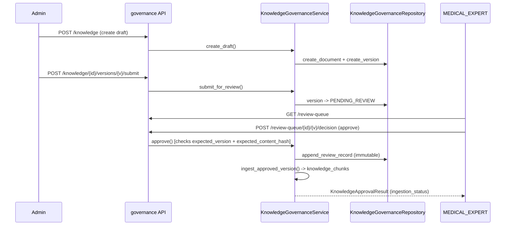

# Knowledge governance architecture (Phase 12)

System that lets ADMIN author knowledge content and MEDICAL_EXPERT approve it before it can ever reach patient retrieval. Extends the Phase 11 knowledge/chat foundation; does not replace it.

## Layers

```
API (app/api/v1/knowledge_governance.py)
  -> role dependencies (app/api/dependencies.py)
  -> KnowledgeGovernanceService (app/services/knowledge_governance_service.py)
  -> KnowledgeGovernanceRepository (app/repositories/knowledge_governance_repository.py)
  -> MongoDB: knowledge_documents, knowledge_document_versions, knowledge_review_records
  -> KnowledgeIngestionService (app/services/knowledge_ingestion_service.py)
  -> knowledge_chunks (approved-only, used by Phase 11 chat retrieval)
```

Frontend consoles call the same governance API:

- ADMIN console: `src/pages/admin/{KnowledgeManagementPage,KnowledgeEditorPage,KnowledgeVersionPage}.tsx`
- MEDICAL_EXPERT console: `src/pages/medical/{MedicalReviewQueuePage,MedicalReviewDetailPage}.tsx`

## Persistence model

| Collection                    | Model                              | Purpose                                                                                                                                         |
| ----------------------------- | ---------------------------------- | ----------------------------------------------------------------------------------------------------------------------------------------------- |
| `knowledge_documents`         | `KnowledgeDocumentDocument`        | Stable parent record: `document_id`, `slug`, `current_version_id`, `current_status`, denormalized approved fields for patient-API compatibility |
| `knowledge_document_versions` | `KnowledgeDocumentVersionDocument` | One row per revision: `version_id`, `version_number`, body, `content_hash`, review timestamps/actors, `supersedes_version_id`                   |
| `knowledge_review_records`    | `KnowledgeReviewRecordDocument`    | Append-only decision log: reviewer, decision, `reviewed_content_hash`, comments, timestamp                                                      |
| `knowledge_chunks`            | `KnowledgeChunkDocument`           | Retrieval units generated only from APPROVED versions; `review_status`/`active` gate patient visibility                                         |

The parent document's denormalized fields (`title`, `body`, `content_hash`, `active`, …) are only ever written when a version becomes APPROVED, is retired, or is restored — they always mirror the current governance decision, never a draft.

## Request flow (typical)



## Related docs

- Lifecycle detail: [`knowledge-content-lifecycle.md`](knowledge-content-lifecycle.md)
- Review workflow detail: [`medical-review-workflow.md`](medical-review-workflow.md)
- Versioning/OCC/hashing: [`knowledge-versioning-and-hashing.md`](knowledge-versioning-and-hashing.md)
- Publication and ingestion: [`knowledge-publication-and-ingestion.md`](knowledge-publication-and-ingestion.md)
- RBAC: [`knowledge-governance-rbac.md`](knowledge-governance-rbac.md)
- Completion report: [`phase-12-knowledge-governance.md`](phase-12-knowledge-governance.md)

## Non-goals (this phase)

No production LLM provider wiring, no automatic/AI approval, no patient-facing authoring, no web crawling, no diagnosis categories. See [`phase-12-knowledge-governance.md`](phase-12-knowledge-governance.md) for the full exclusions list.
